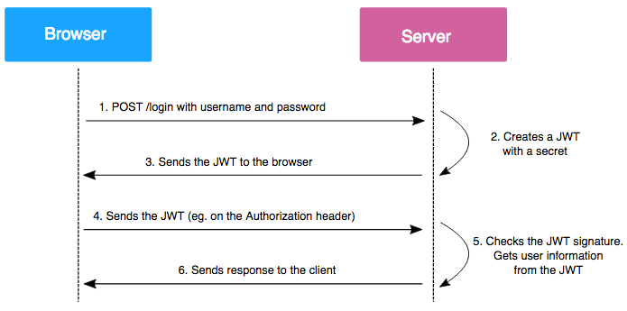
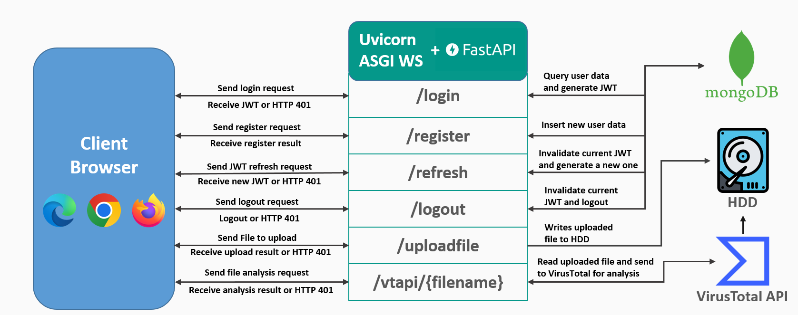

# Implementazione di API RESTful con FastAPI per upload e analisi file tramite VirusTotal

Progetto per l'esame di Sicurezza delle Architetture Orientate ai Servizi.  
  
L'API include le seguenti funzionalità:
* Registrazione / Login tramite query al DBMS NoSQL MongoDB
* Gestione autenticazione tramtie JWT e protezione endpoint con politica Zero Trust
* Utilizzo del middleware di FastAPI per inoltrare tutte le richieste tramite HTTPS
* Caricamento dei file e chiamata all'API di VirusTotal per eseguire l'analisi del file caricato
* Rate limiting sugli endpoint di login e registrazione per evitare sovraccarico sul DB

## Cos'è JWT
JSON Web Tokens, standard RFC 7519, permette funzionalità di autenticazione tramite invio di documenti, in formato JSON, firmati o crittografati.
Il JWT è composto da tre parti:
* Header: contiene informazioni riguardo l'algoritmo di hash per la generazione della firma (alg, solitamente HS256/HMAC-SHA256) e il tipo di JWT (typ)
* Payload: i dati che vengono trasmessi, in genere composto da tre campi: timestamp di emissione (iat), timestamp di scadenza (exp) e oggetto (sub). Possono esserci ulteriori campi/claims, come previsto dallo standard
* Signature: il campo in cui è contenuta la firma per verificare l'integrità del payload
  
Il funzionamento del JWT è descritto nella seguente immagine:
  

  
Il JWT, una volta chiuso il Web Browser, viene eliminato, quindi è necessario effettuare l'autenticazione tramite username e password per generarne uno nuovo.
Un aspetto critico dal punto di vista della sicurezza è che i JWT possono essere usati finchè non raggiungono il tempo di scadenza impostato, quindi un attaccante può intercettarlo e sfruttarlo per accedere alle risorse in maniera impropria. Per limitare la finestra di azione di un attaccante bisogna impostare adeguatamente il tempo di scadenza del JWT, così come realizzare una banlist, in cui sono presenti i JWT non ancora scaduti da non accettare in autenticazione.  
  
Nel progetto viene integrato un middleware di FastAPI, chiamato HTTPSRedirectMiddleware, per reindirizzare tutte le richieste in HTTPS, quindi rendendo i dati trasmessi, tra cui i JWT, sicuri da intercettazione.  
  
Inoltre è stata applicata una politica di Zero Trust in cui tutti gli endpoint dell'API, ad eccezione della registrazione e del login, necessitano di autenticazione tramite JWT (HTTPBearer). Nel caso il token non venga aggiunto nell'intestazione Authorization della richiesta HTTP, gli endpoint restituiscono il codice di errore HTTP 401 UNAUTHORIZED.  

## Diagrammma di interazione degli endpoint e dei componenti




## Installazione ed Esecuzione

Una volta clonata o scaricata la repo, installare i requirements tramite pip tramite cmd o dal prompt del vostro ambiente virtuale (venv o conda):  
```
pip install -r requirements.txt
```
Eseguite i seguenti passaggi: 
* Inserire Certificato cert.pem e chiave privata key.pem nella cartella certs, per l'uso di HTTPS. Si può creare un certificato self-signed e coppia di chaive pubblica-privata tramite OpenSSL
* Inserire chiave pubblica public.pem nella cartella easyjwt, per la firma dei JWT.
* Modificare il file vtapi_key, inserendo la API key fornita da VirusTotal
* Modificare il file db/mongodb.properties con le informazioni per la connessione al server MongoDB. Può essere necessario impostare l'indirizzo IP su cui si sta eseguendo l'applicazione tra gli indirizzi consentiti da MongoDB per la connessione. 

Infine eseguite l'applicazione tramite il comando
```
python app.py
```

FastAPI include un frontend di default per effettuare i test sugli endpoint, accessibile tramite https://localhost/docs .
Se vi restituisce il messaggio che la pagina non è sicura, premete su "Avanzate" e poi su "Procedi comunque", questo è dovuto all'utilizzo di HTTPS con certificato self-signed.


